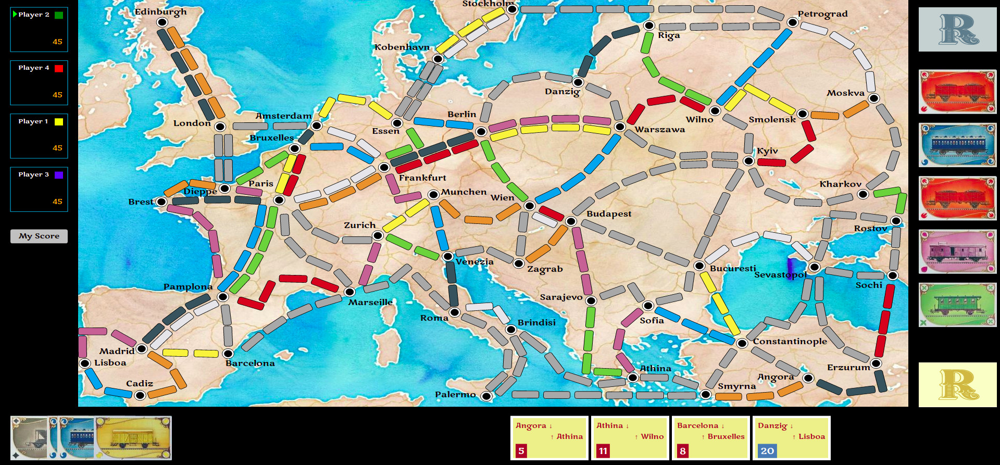

# Ticket to Ride Europe
This is a local version of Ticket to Ride Europe. Works with 2-5 players, typically on a local network with family or friends. It uses socket.io for communication and runs of a local node server. With ngrok or any tunnelling tool, one can expose the http port to external users

## Install 
1. `yarn install` to install node packages
2. `yarn build` to build the frontend using the excellent esbuild bundler
3. `yarn server` to run the server. It listens on port `4000`

Users then connect to http://ip-address:4000, where ip-address is the IP address of the machine running the server. e.g. http: /10.0.0.1:4000.

**Tip**: To change names of players or number of players, update the `client/data/userlist.json` and rebuild `yarn build` and restart server `yarn server`.

## Features
* Users can disconnect and connect back again and state is preserved as long as server is running
* Same rules and game play as official Ticket to Ride. See [Rules](./Rules.pdf). However, the first version has a simpler game play for gray routes. See Pending Features below.
* Scalable to any screen size
* Scrollable ticket and train card areas for large number of cards
* Main board can be zoomed/reset on pressing the `Z` key. Use arrow keys in zoom state to move board around  

## Tech stack
* Javascript and nodejs on backend
* esbuild bundler for frontend bundling
* Frontend vanilla javascript using SVG elements and CSS animations. An earlier verion used the popular Phaser game engine, but ended up rewriting to make it lighter and faster, with vanilla javascript and svg

## Pending features
* Undo not supported yet
* Tunnels and ferries feature not implemented yet. Simpler game play treating all gray routes the same
* Save game sate to disk across server restarts
* Change Player names and player count 

## Usage Notes
This is a fully functional version, as I continue to play this version with my family
 

